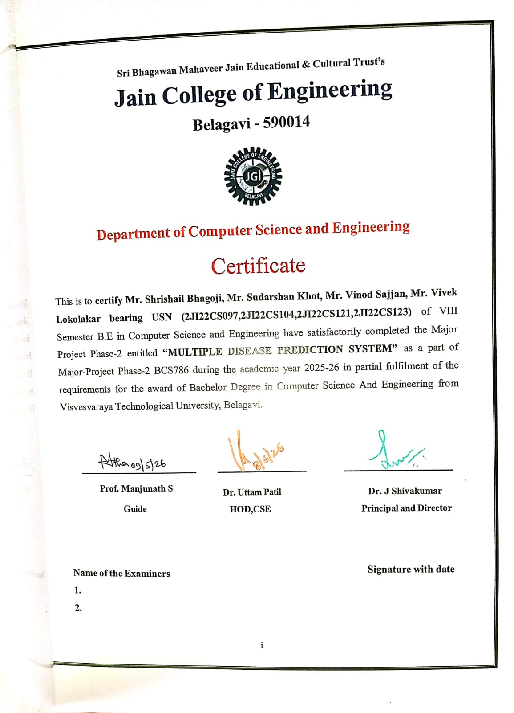
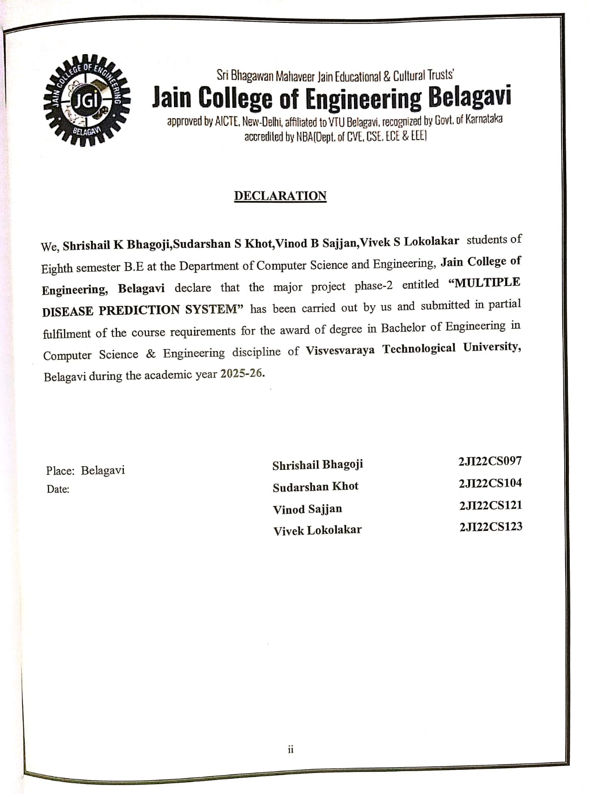
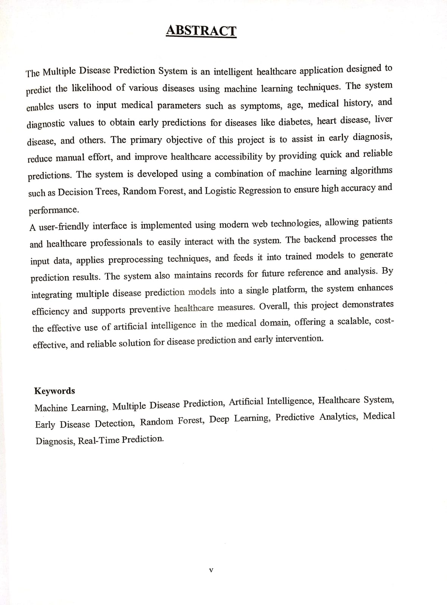

# Multiple Disease Prediction System

A lightweight Python project that provides several machine-learning prediction utilities for common health conditions (diabetes, kidney disease, heart, stroke, lung/pneumonia, Parkinson's disease, eye disease, breast cancer). The repository contains pre-trained models, datasets, and inference scripts bundled under `src` and `models`.

## Features
- Predict diabetes, kidney disease, heart disease, stroke, lung/pneumonia, Parkinson's, eye disease, and breast cancer using pre-trained models.
- Simple command-line / script-based usage and a small example app in `src/app.py`.
- Datasets and model files included for evaluation and demo.

## Repository Structure

- `src/` - Source scripts and notebooks (inference scripts, app, chat utility).
- `models/` - Pre-trained model files used by the scripts.
- `Dataset/` - CSV datasets used for training/analysis.
- `preprocessing/` - (ignored in .gitignore) preprocessing code and assets.
- `requirements.txt` - Python dependencies.

Key files in `src`:
- `app.py` - Example application entrypoint (launch the demo or web app if present).
- `diabetes_prediction.py` - Diabetes inference script.
- `parkinson's_disease_detection.py` - Parkinson's inference script.
- Other notebooks: breast, heart, kidney, lung, stroke, eye disease notebooks for exploration.

## Requirements
- Python 3.8+ recommended
- Create and activate a virtual environment, then install requirements:

```bash
python -m venv venv
# Windows
venv\\Scripts\\activate
# macOS / Linux
source venv/bin/activate
pip install -r requirements.txt
```

## Running the App / Scripts

1. To run the example app (if applicable):

```bash
python src/app.py
```

2. To run a specific prediction script, open and use the corresponding script. For example, to run diabetes inference you can inspect and run:

```bash
python src/diabetes_prediction.py
```

Note: Some scripts expect inputs or may contain example code blocks. Open the Python script or notebook to see how to pass input features or run an example prediction.

## Models and Data
- Models are stored in `models/` (e.g., `diabetes_model.sav`, `kidney_rf_model.sav`, `lung_cancer_rf_model.sav`, etc.).
- Datasets are under `Dataset/` for reference and re-training.

## Notes & Next Steps
- This repo includes Jupyter notebooks demonstrating EDA and training; use them to reproduce or improve models.
- If you want a web UI, I can add a small Flask or Streamlit wrapper around the inference scripts.

**Medika Chatbot**

- **What:** Medika is a lightweight conversational assistant included with this project. It can answer basic health-related questions and invoke the repository's prediction scripts to provide model-backed responses.
- **Files:** The chatbot implementation and launcher are in [src/chat.py](src/chat.py) and [src/chat_launcher.py](src/chat_launcher.py); chat session logs are stored in [src/chat_log.csv](src/chat_log.csv).
- **Run:** Start the chatbot from the workspace root with one of the commands below:

```bash
streamlit run chat_launcher.py
# or
streamlit run chat.py
```

- **Notes:** The chatbot uses the existing prediction scripts (e.g., diabetes, kidney, lung) to produce informed responses; ensure the virtual environment and `requirements.txt` dependencies are installed before running.

## Team Members

- Vivek Lokolakar(@vivek8085)
- Sudarshan khot(@Sudarshan-CSE)
- Vinod Sajjan (@Vintagevinod007)
- Shrishail bhagoji(@shrishail32)

## Images

### Project Screenshot 1


### Project Screenshot 2


### Project Screenshot 3


### Project Screenshot 4


### Team


## Credits
Created as a multi-disease prediction demo. Feel free to contribute...